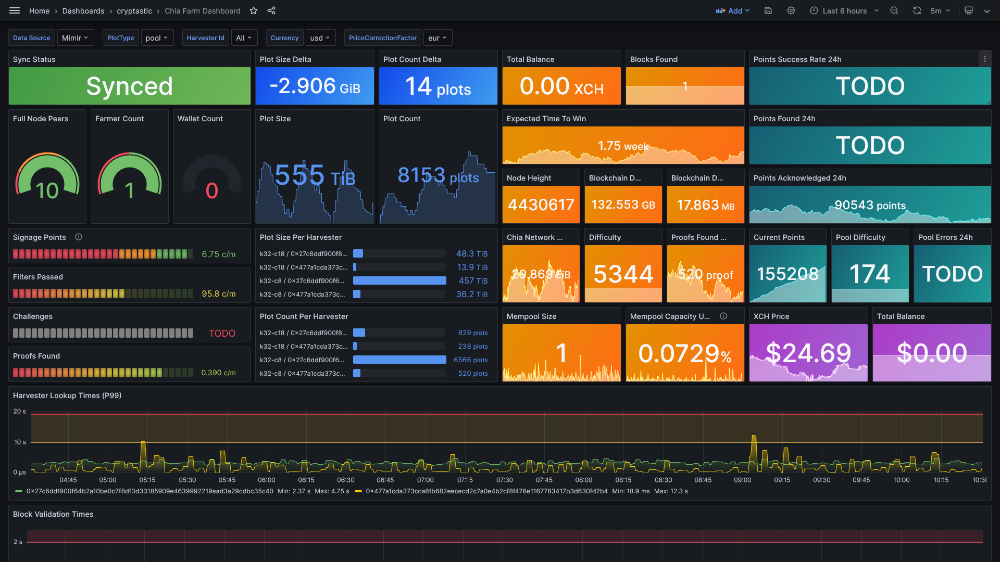

# Chia Farm Dashboard

Displays all important metrics from your [Chia](https://github.com/Chia-Network/chia-blockchain/) farming node and all
connected harvesters, collected by the official
[Chia Exporter](https://github.com/Chia-Network/chia-exporter/). To show the current price of Chia, the
unofficial [Chia Price Exporter](https://github.com/stefan-lange/chia-price-exporter/) is required.

This dashboard is based on the great work made by [Philipp Normann](https://github.com/philippnormann/chia-monitor) and
available under <https://grafana.com/grafana/dashboards/16456>



**_The dashboard is an alpha version and may contain some bugs or unimplemented features!_**

## Configuration

A working [Chia Exporter](https://github.com/Chia-Network/chia-exporter/) (version `>= 0.10.0`)
and [Chia Price Exporter](https://github.com/stefan-lange/chia-price-exporter/) is required.

Since v0.10.0, the chia-exporter uses the new farming protocol. It is now possible to retrieve basic harvester metrics
via the farmer, which simplifies the whole setup. Chia-exporter must be installed `only` next to the farmer, not on
every harvester node.

### Scenario: chia farm with farmer and multiple harvesters

Prerequisites:

- installed chia farmer
- installed chia harvester(s)
- installed chia-exporter on farmer host
- installed chia-price-exporter 'somewhere' (or on the farmer host)

Add a block to the `scrape_configs` of your `prometheus.yml` config file:

```yaml
scrape_configs:
    -   job_name: 'chia-price-exporter'
        scrape_interval: 60s
        static_configs:
            -   targets: [ '<<CHIA-PRICE-EXPORTER-HOST>>:9952' ]

    -   job_name: 'chia-farmer'
        scrape_interval: 30s
        static_configs:
            -   targets: [ '<<CHIA-FARMER-HOST>>:9914' ]
```

Adjust the hosts accordingly. Use the `ip` or `hostname`.